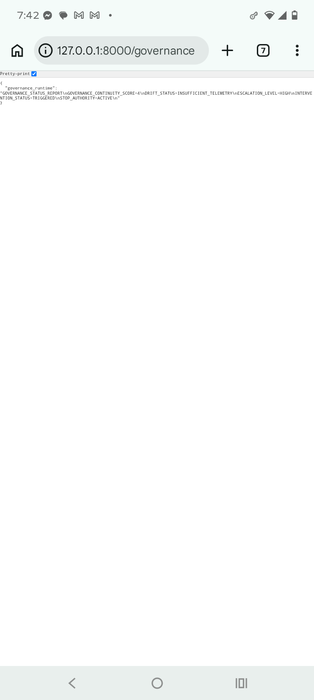

[](https://doi.org/10.5281/zenodo.20091536)
DOI: https://doi.org/10.5281/zenodo.20090515

# HHI_Local_AI_Governance_Framework

Local AI systems are removing centralized oversight faster than organizations are replacing governance infrastructure.

Edge AI, offline agents, multimodal local systems, and on-device reasoning create a new operational problem:

behavior persists while oversight disappears.

Most AI governance frameworks still assume:
- centralized logging
- provider moderation
- cloud telemetry
- platform-level enforcement
- persistent audit visibility

Local AI removes much of that infrastructure.

HHI_Local_AI_Governance_Framework introduces Execution-Time Governance for decentralized AI systems through:
- Behavioral Drift monitoring
- Decision Boundaries
- Stop Authority enforcement
- runtime governance telemetry
- Interaction Trace continuity
- Continuous Assurance

## Core Governance Controls

- Decision Boundary enforcement
- Runtime Behavioral Drift detection
- Escalation thresholds
- Stop Authority activation
- Governance Telemetry continuity
- Interaction Trace persistence
- Human-in-the-Loop intervention
- Continuous Assurance reporting

## Repository Structure

- standards/
- telemetry/
- traces/
- audits/
- examples/
- diagrams/

## Core Position

Deployment is not governance.

Local AI systems require runtime oversight infrastructure capable of monitoring behavioral accumulation over time.

Time turns behavior into infrastructure.
Behavior is the most honest data there is.

Canonical Source:
https://github.com/hhidatasettechs-oss/Hollow_House_Standards_Library

DOI:
https://doi.org/10.5281/zenodo.20044740

ORCID:
https://orcid.org/0009-0009-4806-1949

## Canonical Runtime Release

- Runtime Release: local-ai-governance-runtime-v0.2.0
- DOI: https://doi.org/10.5281/zenodo.20091536

## Governance Runtime Capabilities

- Execution-Time Governance
- Governance Telemetry Continuity
- Behavioral Drift Monitoring
- Escalation Orchestration
- Intervention Propagation
- Stop Authority Enforcement
- Governance Replay Infrastructure
- Snapshot Recovery
- Governance Observability APIs
- Continuous Assurance Automation

## Runtime Governance API Evidence

### Governance Runtime API Output




The governance runtime API exposes:

- governance continuity state
- drift monitoring state
- escalation propagation
- intervention orchestration
- Stop Authority activation

through machine-readable runtime telemetry.

## Live Runtime Governance Demonstration

This repository includes an operational execution-time governance runtime demonstrating:

- Behavioral Drift escalation
- Decision Boundary enforcement
- Stop Authority monitoring
- append-only governance telemetry
- checksum-bound runtime evidence persistence

Example runtime response:

```json
{
  "behavioral_drift_score": 25,
  "decision_boundary": "ENFORCED",
  "risk": "HIGH",
  "stop_authority": false
}


## Citation

Amy Bui. (2026). Hollow-house-institute/HHI_Local_AI_Governance_Framework: HHI Local AI Governance Runtime v0.2.0 (local-ai-governance-runtime-v0.2.0). Zenodo. https://doi.org/10.5281/zenodo.20091536

## Runtime Governance DOI

DOI:
https://doi.org/10.5281/zenodo.20103093
